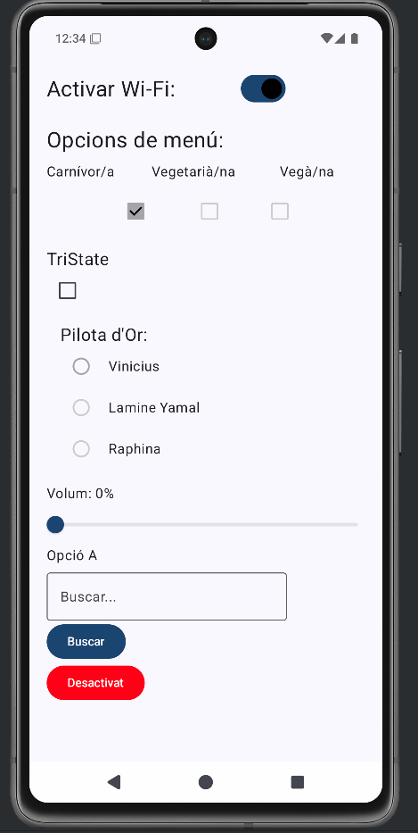
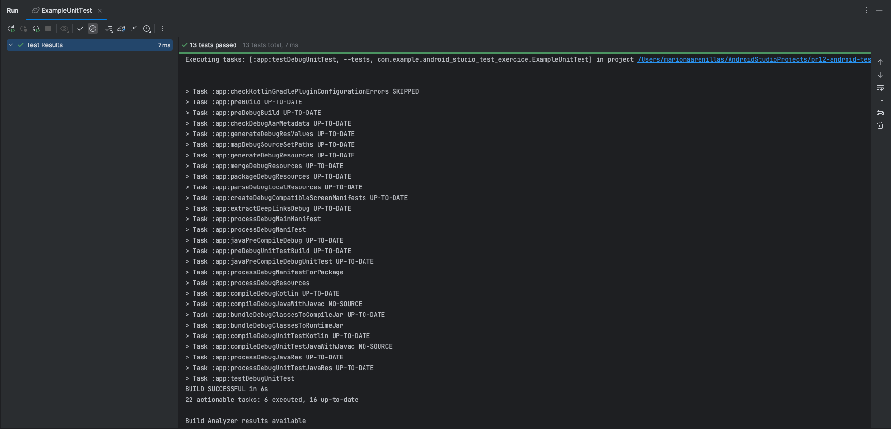
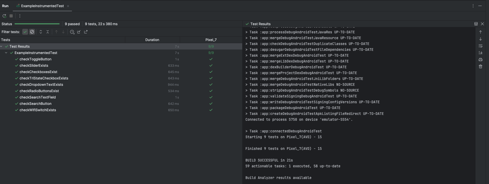

# Android Testing: Unit Testing + UI Testing

---

## Descripció del projecte

Aquesta pràctica consisteix en completar una aplicació Android desenvolupada amb **Kotlin + Jetpack Compose**, seguint el patró d’arquitectura **MVVM (Model - View - ViewModel)**, i implementar tant **Unit Testing** com **Instrumental UI Testing**.

L’objectiu principal és validar correctament:

- la lògica del `ViewModel`
- la interacció dels composables de la interfície
- el funcionament general de l’aplicació

La pràctica parteix d’un repositori base proporcionat i s’han completat les parts pendents de `MainView` i `MainViewModel`, mantenint el disseny original de l’aplicació.

---

## Funcionament de l’aplicació

L’aplicació mostra diferents components interactius de Jetpack Compose per practicar testing en Android:

### Elements principals de la pantalla

- **Switch** per activar/desactivar el Wi-Fi
- **Checkboxes** per seleccionar opcions de menú:
  - Carnívor/a
  - Vegetarià/na
  - Vegà/na
- **TriStateCheckbox** amb 3 estats:
  - Off
  - Indeterminate
  - On
- **RadioButtons** per seleccionar la Pilota d'Or
- **Slider** per controlar el volum
- **DropdownMenu** amb diferents opcions
- **OutlinedTextField** per fer una cerca
- **Botó Buscar** que mostra el missatge:
  `"Acció completada!"`
- **Botó final** que canvia entre:
  - Activat (verd)
  - Desactivat (vermell)

Tota la lògica està gestionada des del `MainViewModel`, mentre que `MainView` només observa els estats mitjançant `observeAsState()`.

Captura del resultat de l'aplicació:

---

## Arquitectura MVVM

- `MainView.kt`: conté la interfície d'usuari amb Compose.
- `MainViewModel.kt`: conté els estats amb LiveData i la lògica de la pantalla.
- `ExampleUnitTest.kt`: comprova els mètodes del ViewModel.
- `ExampleInstrumentedTest.kt`: comprova els composables de la MainView.

---

## Unit Testing

S'han creat tests per comprovar tots els mètodes del ViewModel:

- `toggleEstatSwitch()`
- `toggleEsVegetaria()`
- `toggleEsVega()`
- `toggleEsCarnivor()`
- `toggleTriStateStatus()`
- `setSelectedOption()`
- `setSliderValue()`
- `setExpanded()`
- `setSelectedItem()`
- `setSearchText()`
- `performSearch()`
- `toggle()`

Captura dels Unit Tests:

---

## Instrumental UI Testing

S'han creat tests de UI per comprovar els composables principals:

- Switch Wi-Fi
- Checkboxes
- TriStateCheckbox
- RadioButtons
- Slider
- DropdownMenu
- TextField de cerca
- Botó Buscar
- Botó Activat/Desactivat

Captura dels UI Tests:

---
## Documentació extra

En aquest enllaç trobareu el video de la demostració de l'aplicació: [Video tests](https://drive.google.com/drive/folders/1R2CUE6wfIwF6TVYI9gszHrWpOcwcDENv?usp=share_link)

Aquí teniu el GIF de la comprovació dels tests de l'aplicació:
<!---->
